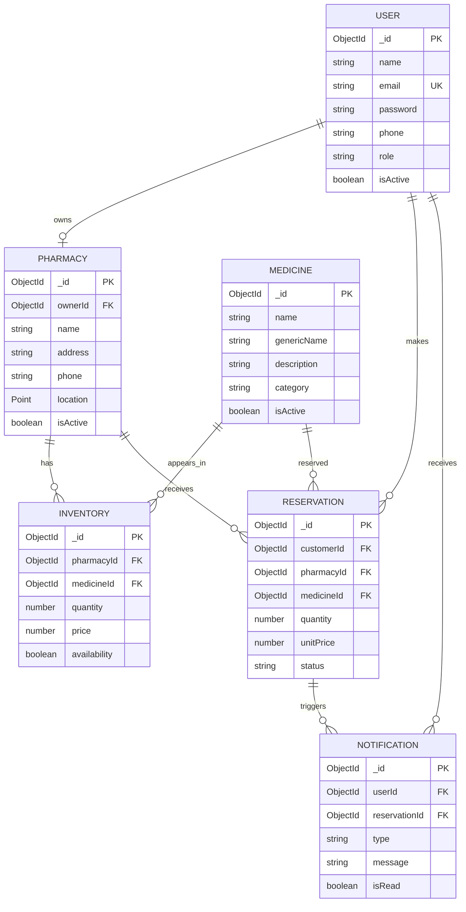

# MediFind ERD

```mermaid
erDiagram
    USER ||--o| PHARMACY : owns
    USER ||--o{ RESERVATION : makes
    USER ||--o{ NOTIFICATION : receives
    PHARMACY ||--o{ INVENTORY : has
    MEDICINE ||--o{ INVENTORY : appears_in
    PHARMACY ||--o{ RESERVATION : receives
    MEDICINE ||--o{ RESERVATION : reserved
    RESERVATION ||--o{ NOTIFICATION : triggers

    USER {
        ObjectId _id PK
        string name
        string email UK
        string password
        string phone
        string role
        boolean isActive
    }
    PHARMACY {
        ObjectId _id PK
        ObjectId ownerId FK
        string name
        string address
        string phone
        Point location
        boolean isActive
    }
    MEDICINE {
        ObjectId _id PK
        string name
        string genericName
        string description
        string category
        boolean isActive
    }
    INVENTORY {
        ObjectId _id PK
        ObjectId pharmacyId FK
        ObjectId medicineId FK
        number quantity
        number price
        boolean availability
    }
    RESERVATION {
        ObjectId _id PK
        ObjectId customerId FK
        ObjectId pharmacyId FK
        ObjectId medicineId FK
        number quantity
        number unitPrice
        string status
    }
    NOTIFICATION {
        ObjectId _id PK
        ObjectId userId FK
        ObjectId reservationId FK
        string type
        string message
        boolean isRead
    }
```
